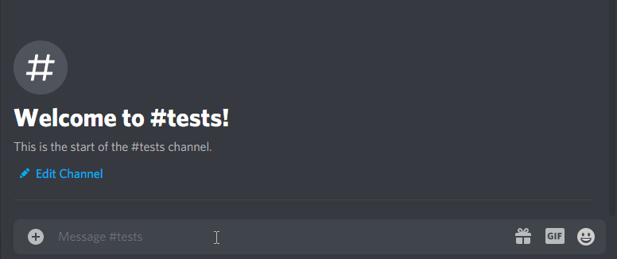

# Asset Store Invoice Verifier Bot
This is a Discord bot that will verify Invoice Numbers from the Unity Asset Store API and assign a role to the user submitting the invoice for verification. You need to create your own bot, setup services and fork the code so you can add your own api key. If someone has ideas on improvements, feel free to reach out about them.

# Requirements
* Your own discord bot with proper permissions. (this is not a shared bot)
* Your own Repl.it of this code.
* Your own uptimerobot.com to ping the bot.
* Your own API Key and Bot Token added to your repl.it code.
* A "Verified" role in your server (you can change this, or do whatever you want, this is just default)

# How To Setup
This bot is based on the nice tutorial here that covers how to setup the services: https://www.youtube.com/watch?v=SPTfmiYiuok

You need to...
1. Create a Application/Bot through Discord's developer dashboard.
2. Create a Repl.it which runs, logs in the bot, and reads messages. (the .py code files in the repo)
3. Add the bot to your server with the correct permissions (read messages, manage messages, assign roles)
4. In your Repl.it add a .env file with the Discord Bot Token and Unity Store API Key variables.
5. Use uptimerobot.com to ping your Repl.it to keep it from sleeping after being inactive for an hour.
6. Test your bot in your guild server.

Check out the video for details on how that all works. It's a very good tutorial, clear and concise, and will answer your questions. The code here is basically just the code to run the bot and talk to the unity API. You'll still have to setup the services, give the bot permissions, etc.

# Process of the bot and interfacing with it
1. A user in your server writes `$verify ` followed by an invoice number in a message
2. The bot reads every message in the server and looks to see if they start with `$verify`.
3. If it does, then the bot will delete the message, extract the invoice number and try to send it to the Asset Store API.
4. The results it gets back determine if it is either a) broken, b) refunded, or c) valid.
5. It will respond appropriately, and if c) then assign a role that is by default named "Verified".

# Security
The bot reads messages that are posted to the channels and deletes them when a verification message is posted, but note that the message is indeed already posted in the channel. This means that there is a possibility that someone could lurk/scrub the messages to obtain invoice numbers and then feign ownership later. Since there is no implementation for tracking which invoices are already verified, this may be an issue for you - particularly if you use the role as a gate to premier support channels.

# Recommendations
This is a simple personal bot using free online services. It costs nothing and will probably work fine for a lot of cases. If you need something more reliable you should probably consider rolling your own on a custom site you own and migrate responsibility for the service over to things you have more control over. This works, but it is admittedly a little smelly.
